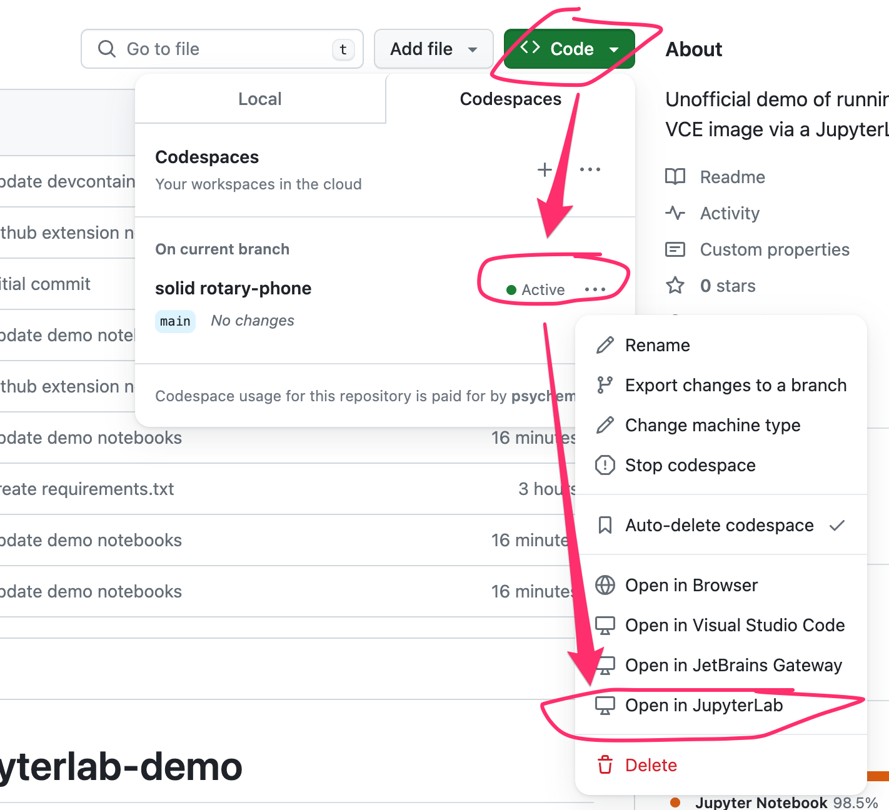

# m269-devcontainer-jupyterlab-demo

Unofficial demo of running the M269 VCE image via a JupyterLab UI using GitHub Codespaces.

The `.devcontainer` set-up adds JupyterLab to the container (this can also be done via the VCE Docker comtainer builder config file) along with various JupyterLab extensions that customise the environment.

If you start the container using Codespaces and it opens into VS Code by default (you can change this from GitHub settings menu somewhere), you can open the running or stopped container into JupyterLab from a pop up menu raised from that codespace reference:

If you open you clone of this repo in Codespaces into JupyterLab, you should find various demo notebooks that demonstrate among other things:

- use of template notebooks
- rich MyST markdown extensions
- git/GitHub integration (more to do)

You should not need to use a password to access the JupyterLab environment.
